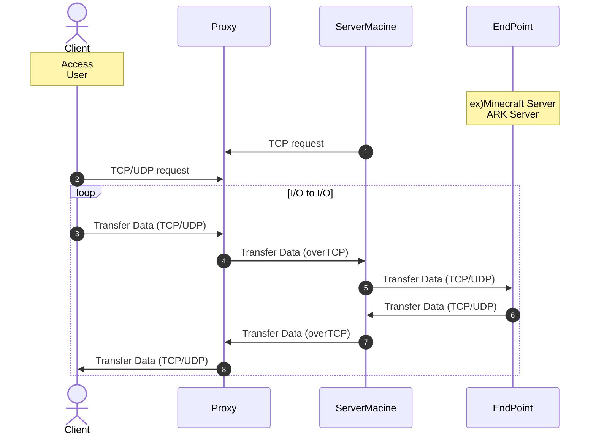

# go2tunnel
開発環境 : go version go1.17.8 linux/arm64 raspi4 8GB  

## how to use
1. go run main.go -env="???.json" で "BootServer":"Proxy" で起動  
2. go run main.go -env="???.json" で "BootServer":"Server" で起動  
Server Proxy どっちを先に起動しても問題なし

## 変数 について
```json
{
  "comment": "転送するProtcol tcp/udpのみ",
  "TransferProtcol": "tcp", 
  "comment": "サーバーへアクセスする際のアドレス",
  "ToServer": "localhost:25565",
  "comment": "Server=>ProxyのProxy Address",
  "DialupToProxy": "example.com:80",
  "comment": "Server=>ProxyのProxy Port",
  "ListenByServer": ":80",
  "comment": "Client=>ProxyのProxy Port",
  "ListenByClient": ":22",
  "comment": "ServerなのかProxyなのかを指定",
  "BootType": "Server"
}
```
## 動作

